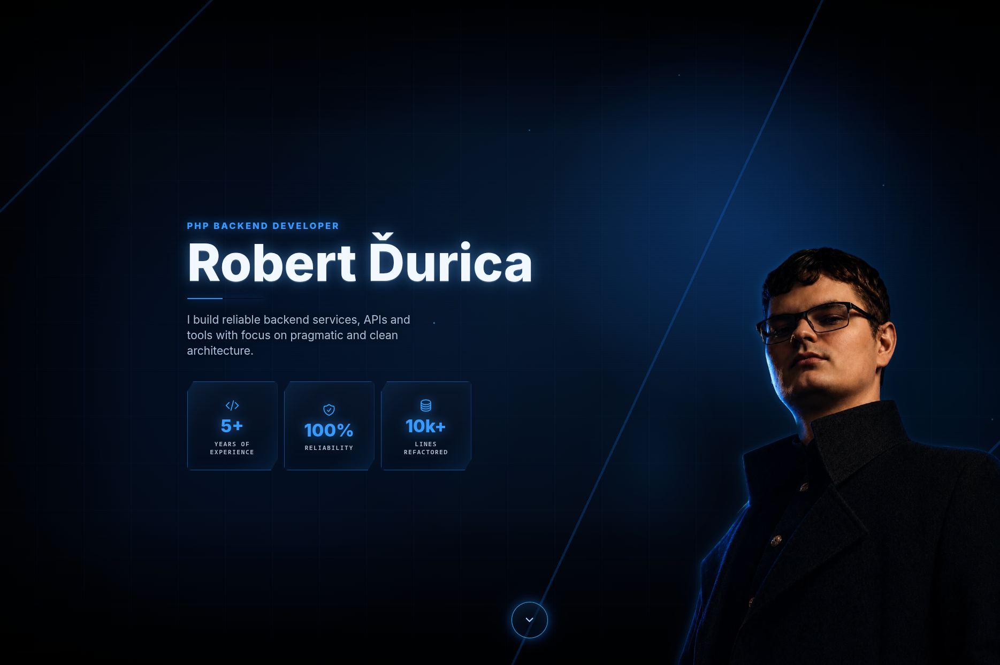

# Robert Durica - personal portfolio

[](http://php.net)
[](https://www.docker.com/)
[](https://getcomposer.org/)



## Overview

This repository contains the source code of my personal developer portfolio. It showcases selected projects, technical
skills, certifications, and professional experience – with a focus on backend development in PHP, modern DevOps tools,
and clean software architecture.

## Tech Stack

- **Backend:** PHP 8.5, Symfony 7.3, FrankenPHP
- **Frontend:** Vite, Node.js 20+
- **Database:** PostgreSQL (with Doctrine ORM)
- **Cache / Sessions / Queue:** Redis
- **Infrastructure:** Docker, Docker Compose

## Setup

```bash
# First-time setup
make init

# Start containers
make up

# Run inside container
docker compose exec portfolio composer install
docker compose exec portfolio npm install
docker compose exec portfolio npm run dev
```

## License

This project is licensed under the terms of the MIT license.
